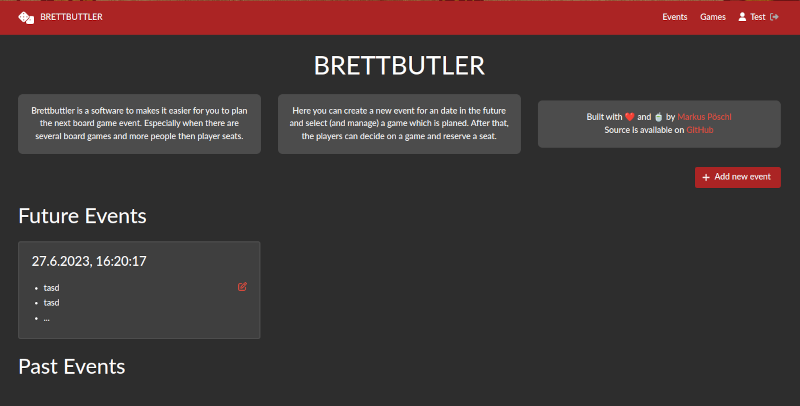

# Brettbutler

Brettbutler is a software to makes it easier for you to plan the next board game event.
Especially when there are several board games and more people than player seats.

## Features

* Manage available games (Number of players, Playtime, Description, Url)
* Create an event an add games to it
* Participates can require on any future event
* Login with just a name

## Setup

For an easy setup, a docker-compose file is provided in the `deploy` folder.
It is just a basic setup with traefik as reverse proxy on `http`.
Depending on the environment a certificate for TLS is recommended.

### Plausible tracking

If configured the application can be monitored with [Plausible](https://plausible.io/).

To enable this set the environment variable `VITE_PLAUSIBLE_DOMAIN`
and if you are running on a self-hosted instance `VITE_PLAUSIBLE_API_HOST`.
An example is shown in the deploy docker-compose.

## Note

This software will get no versioning and lives on the bloody main branch.

## Development

For development there is a little script in the project root named `start_dev_env.sh`.
Executing it as well as `.gradlew backend:bootRun` (from project root) and `npm run dev` (from the `frontend` folder)
will set up the local environment on http://localhost:8888.
